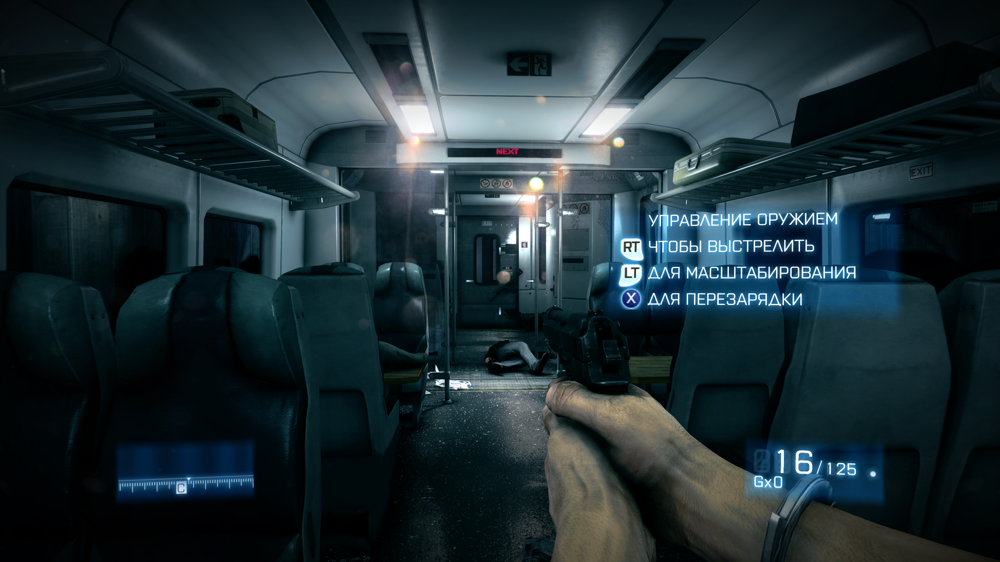
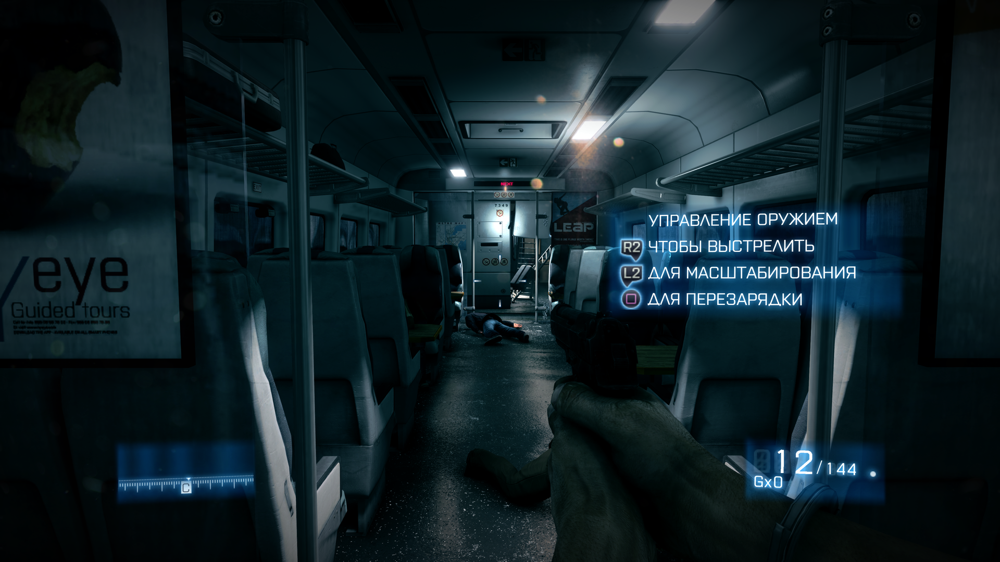

# BF3GamepadFix

| Feature | Status |
| :--- | :---: |
| **Xbox 360 Prompts** | ✅ Supported |
| **PlayStation 3 Prompts** | ✅ Supported |
| **QTE Controls & Prompts** | ✅ Supported |
| **Game Version** | Build **1147186** |

Gamepad controls and Xbox 360 / PlayStation button prompts for the **Battlefield 3 single-player campaign on PC**. Keeps the PC menus and graphics settings, with UI scaling included.

**Version 0.22.4 is a pre-release.** Both prompt styles have been confirmed in gameplay; full campaign verification is ongoing.

## In-game preview

<table width="100%">
  <tr>
    <td width="50%" align="center">
      <a href="https://raw.githubusercontent.com/tronuo0/BF3GamepadFix/main/assets/screenshots/xbox360-prompts.png" target="_blank" rel="noopener noreferrer"></a>
      <br><em>Xbox 360 Prompts</em>
    </td>
    <td width="50%" align="center">
      <a href="https://raw.githubusercontent.com/tronuo0/BF3GamepadFix/main/assets/screenshots/playstation-prompts.png" target="_blank" rel="noopener noreferrer"></a>
      <br><em>PlayStation 3 Prompts</em>
    </td>
  </tr>
</table>

## Install

1. Close the game.
2. [Download **BF3GamepadFix.exe**](https://github.com/tronuo0/BF3GamepadFix/releases/download/v0.22.4/BF3GamepadFix.exe) and open it.
3. Choose **Xbox 360** or **PlayStation 3**, then click **Install**.
4. When the button changes to **Installed**, launch the game normally.

The installer finds the game through its location, EA installation records or Steam libraries. If it cannot find the game, click **Select game...** and select `bf3.exe`, then click **Install**. You can keep the installer in your Downloads folder. No ZIP extraction or manual file copying is needed.

Requires **64-bit Windows** and Battlefield 3 resource build **1147186**. The installer checks compatibility before changing game files. Download the EXE under the release's **Assets**; the source archives are for developers.

## Settings

Open the installer again and select **Xbox 360** or **PlayStation 3**. Once installed, selecting either option saves the prompt style immediately. Restart the game to apply it.

You can also edit `BF3Controller.ini` next to `bf3.exe`:

```ini
[Controller]
PromptStyle=Xbox360
```

| Value | Button prompts |
| :--- | :--- |
| `Xbox360` | Xbox 360 (default) |
| `PS3` | PlayStation 3 |

This changes the button icons; controls use XInput in both modes. PlayStation controllers must be available to the game through XInput.

## Uninstall

Close the game. Open PowerShell in the folder containing the downloaded EXE and run the following command, replacing the game path with your folder containing `bf3.exe`:

```powershell
.\BF3GamepadFix.exe remove "C:\Games\Battlefield 3"
```

This restores the archives and loader from before installation. Keep `ControllerMod/BF3GamepadFix` in the game folder until you uninstall; it contains the restore record and previous loader. The downloaded EXE contains the required patch data.

## Credits

Includes [BF3-UI-Scaling-Fix v1.04](https://github.com/IlIHydraIlI/BF3-UI-Scaling-Fix). A separate UI Scaling Fix installation is not required. See [third-party notices](docs/THIRD_PARTY_NOTICES.md) for credits and licenses.

[Build instructions](docs/build.md) · [Verification details](docs/verification.md)
